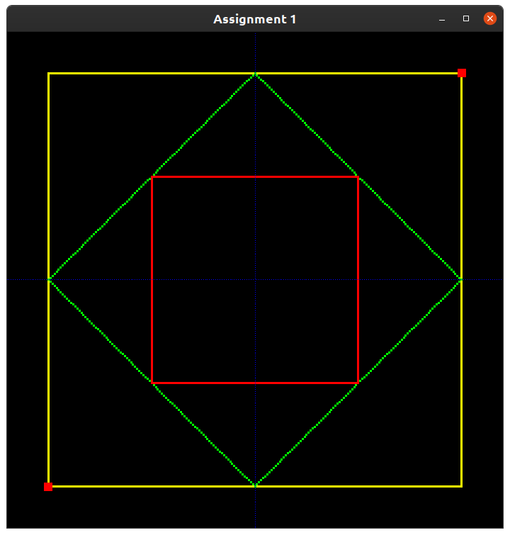
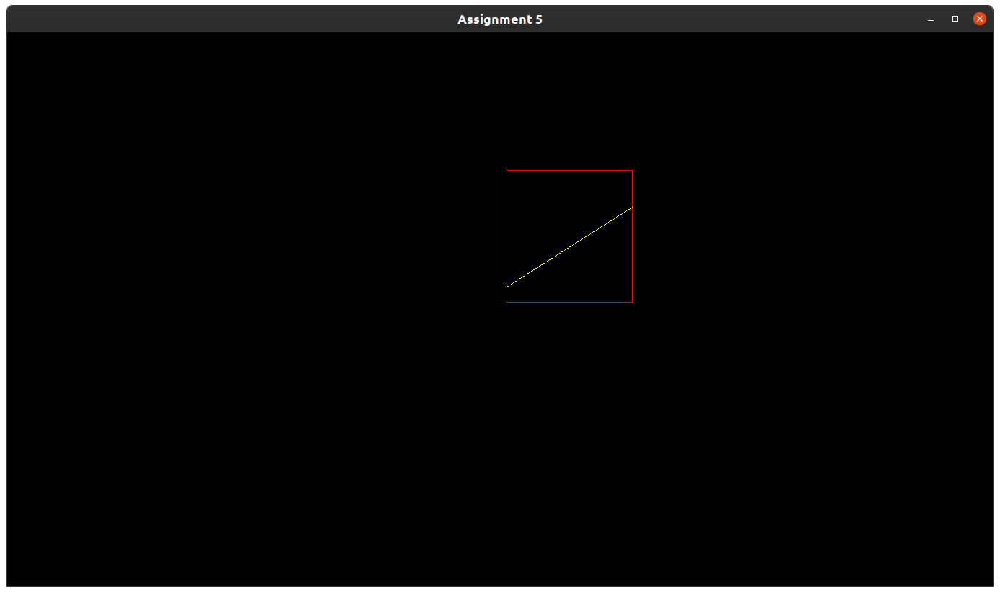
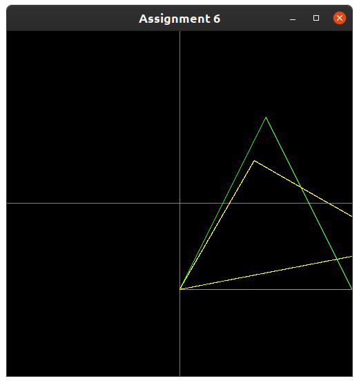
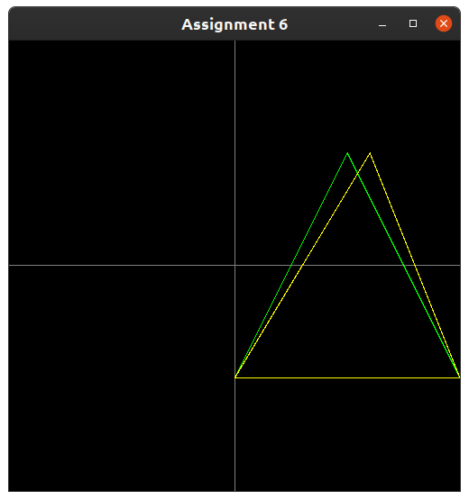
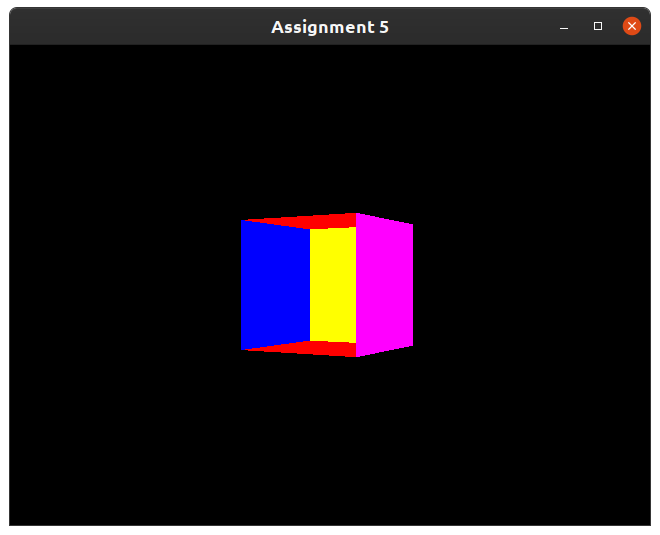
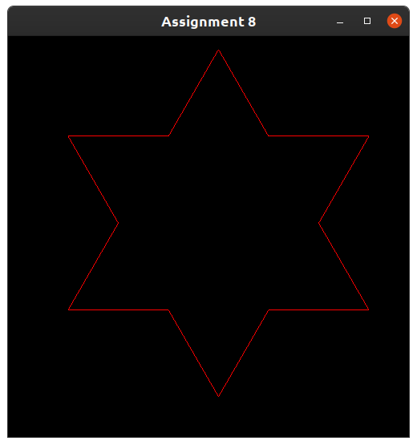
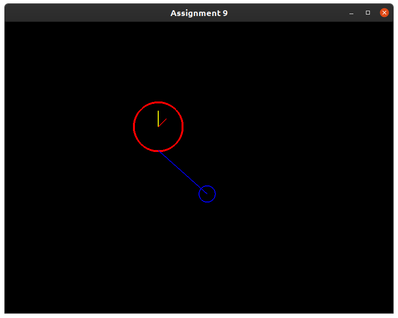
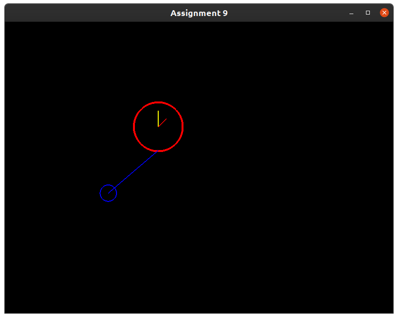
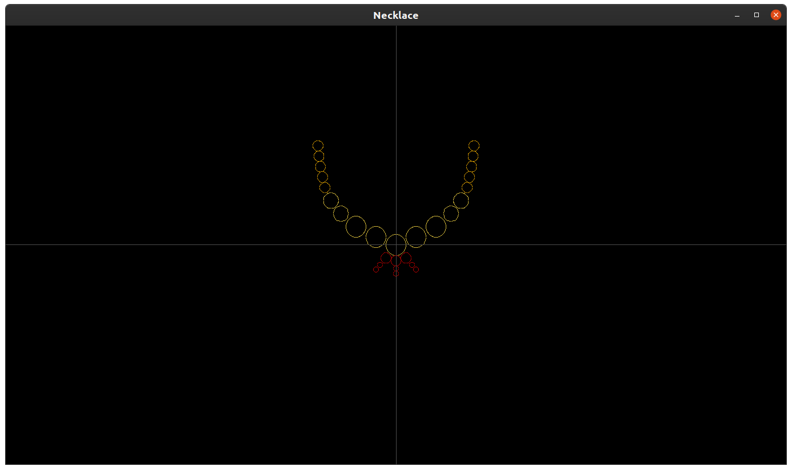

# Computer Graphics Assignments

## All computer graphics assignments of SPPU Second Year IT Syllabus

### To compile, use 
`g++ file_name.c -lglut -lGL -lGLEW -lGLU -o OpenGLExample`

### To execute, use
`./OpenGLExample`

### Find the lab manual here: [Computer Graphics Lab Manual](CG.pdf)

## Table of Contents for Assignments

| Program Name                     | Problem Statement                    |
| :-----------------------------:  | :--------------------------------    |
|[Assignment1.c](Assignment1/23260_AssignNo1.c)|Draw the given pattern using DDA and Bresenham line drawing algorithm.|
|[Assignment2.c      ](Assignment2/23260_AssignNo2.c)|Draw inscribed and Circumscribed circles in the triangle as shown as an example below using circle drawing algorithm.|
|[Assignment3(1).cpp ](Assignment3/23260_AssignNo3Click.cpp)|Mouse Click|
|[Assignment3(2).cpp ](Assignment3/23260_AssignNo3Drag.cpp)|Mouse Drag|
|[Assignment4.c      ](Assignment4/23260_AssignNo4.c)|Draw a 4x4 chessboard rotated 45 degrees with horizontal axis. Use bresenham algorithm to draw all the lines. Use seed fill algorithm to fill black spaces of chessboard.|
|[Assignment5.cpp    ](Assignment5/23260_AssignNo5.cpp)|Implement Cohen Sutherland algorithm to clip an given line/polygon. Provide the vertices of the line/polygon to be clipped and the pattern of clipping interactively.|
|[Assignment6.c      ](Assignment6/23260_AssignNo6.c)|Implement translation, sheer, rotation and scaling transformations on equilateral triangle and rhombus.|
|[Assignment7.cpp    ](Assignment7/23260_AssignNo7.cpp)|Implement Cube rotation about verticalaxis passing through the centroid.|
|[Assignment8.c      ](Assignment8/23260_AssignNo8.c)|Generate fractal patterns by using Koch curves|
|[Assignment9.cpp    ](Assignment9/23260_AssignNo9.cpp)|Pendulum Animation|

## Table of Contents for Other programs

| Program Name                     | Description                          |
| :-----------------------------:  | :--------------------------------    |
|[Necklace.cpp](Other/Necklace.cpp)|Necklace pattern|
|[hashline.cpp](Other/hashline.c) |Hashline pattern|

## Output Snippets

* ### [Assignment1](Assignment1/23260_AssignNo1.c)

* ### [Assignment2](Assignment2/23260_AssignNo2.c)

* ### [Assignment3-Click](Assignment3/23260_AssignNo3Click.cpp)

* ### [Assignment3-Drag](Assignment3/23260_AssignNo3Drag.cpp)

* ### [Assignment4](Assignment4/23260_AssignNo4.c)

* ### [Assignment5](Assignment5/23260_AssignNo5.cpp)

* ### [Assignment6](Assignment6/23260_AssignNo6.c)

* ### [Assignment7](Assignment7/23260_AssignNo7.cpp)

* ### [Assignment8](Assignment8/23260_AssignNo8.c)

* ### [Assignment9](Assignment9/23260_AssignNo9.cpp)

* ### [Necklace](Other/Necklace.cpp)

* ### [Hashline](Other/hashline.c)

